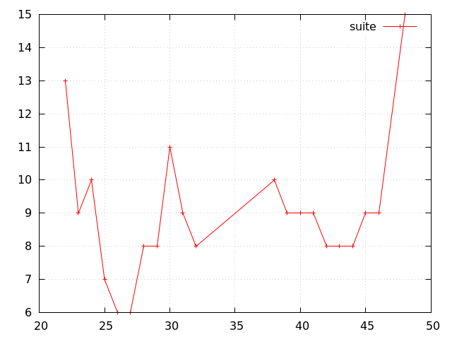
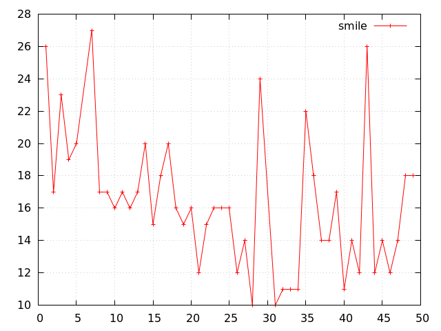
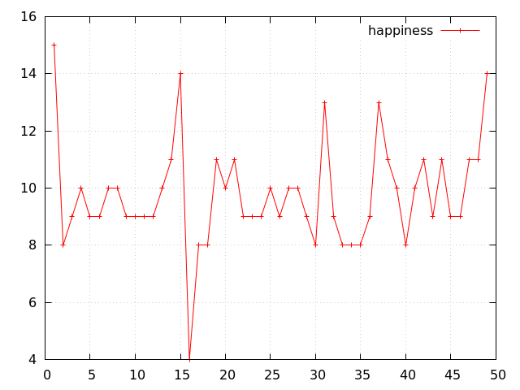
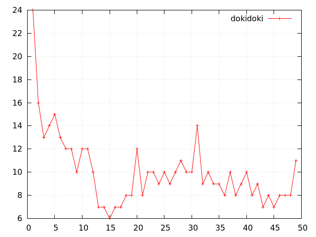
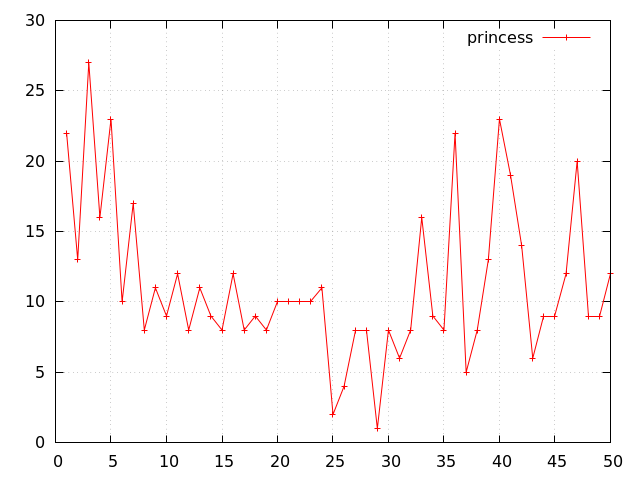

# プリキュア実況スレ消費数

## 概要
プリキュア見てて、ちょっと気まぐれで２ちゃん (.net) の実況板見たらすごい過疎ってた.

## 関連サイト
大昔のプリキュア実況スレまで、タイトルだけでいいので、全部列挙したい.
[ものすごい勢いで２ちゃんねる実況の過去ログとかテレビのキャプ画像をまとめるページ](http://2chlog.com/2ch/live/makeimghtml.php)
ってのが良さそう.
今のプリキュアなら
[こんなカンジ](http://2chlog.com/2ch/live/thread_search/thread_search.php?page=8&term=all&word=%83v%83%8A%83%93%83Z%83X%83v%83%8A%83L%83%85%83A)
で、
第一話から問題なく、全てあるようだ.
これを使うことにする.

ちなみにこのサイト、変な検索をするとすぐSQLエラーが出るし (セキュリティ大丈夫なのだろうか)、
けして軽いサイトでもないので気を遣わなくちゃ.

## 手法
先ほどの
[ものすごい勢いで２ちゃんねる実況の過去ログとかテレビのキャプ画像をまとめるページ](http://2chlog.com/2ch/live/makeimghtml.php)
を使って作品名をキーワードにして、
それらしいタイトルのものを数える.

今回、そこまで厳密さは求めないことにする.
どうせ大体の数字だし.

例えば、
スレッドのタイトルだけを見て数えるけれど、
そのスレッドは立てられただけ立てられて、全然書き込まれなかったものかもしれない.
書き込まれてても放送終了後かもしれない.

タイトルにはふつうナンバリングがしてあるが、
重複があったりするし、信用しないことにする.

### それらしいタイトルとは

全部 `★数字$` で行けるやろって思ってた.
割とバリエーションがあって、
例えば、

- "Go!プリンセスプリキュア 第1話☆6 [転載禁止]&copy;2ch.net"
- "Go!プリンセスプリキュア 第3話 part8 [転載禁止]&copy;2ch.net"
- Goプリンセスプリキュア#5 その7 [転載禁止]&copy;2ch.net	
- "Go!プリンセスプリキュア 第12話@5 [転載禁止]&copy;2ch.net"
- goプリンセスプリキュア20話★3 [転載禁止]&copy;2ch.net	
- "Gプリンセスプリキュア 第21話 ★7 [転載禁止]&copy;2ch.net"

などなど.
もっと統一されたフォーマットが取られてるものだと思ってた.

## 候補一覧の取得

「プリンセスプリキュア」で検索を引っ掛けて得られるタイトル一覧を保存するスクリプトを次に挙げる.
直接、検索語をURIエンコードしたものを埋め込んでるのはダサいけど、
直で書くと、サイトがSQLエラー(!)を吐くので、諦めてる.

```bash
#!/bin/bash

LOG=princess.log
: > $LOG
LN=0

for i in `seq 0 10000`; do
  curl -s "http://2chlog.com/2ch/live/thread_search/thread_search.php?page=$i&term=all&word=%83v%83%8A%83%93%83Z%83X%83v%83%8A%83L%83%85%83A" | nkf | grep 件見つ | sed 's,</td>,\n,g' | grep l50 | sed 's/<[^>]*>//g' | tee -a $LOG
  LN2=`wc -l $LOG | cut -d' ' -f1`
  echo $LN2
  if [ $LN -eq $LN2 ]; then
    break
  fi
  LN=$LN2
  sleep 1
done
```

## 候補を絞る

先程述べた「それらしいタイトル」をgrepで選択する.
結局次のようにした.

```bash:count.sh
#!/bin/bash

LOG=$1
for i in `seq 50`; do
  LN=`cat $LOG | grep "[^0-9]${i}★\|[^0-9]0${i}話\|[^0-9]${i}わ\|[^0-9]${i}話\|#${i}[^0-9]" | wc -l`
  echo $i $LN
done |
grep -v ' 0$'
```

```bash
./count.sh princess.log
1 22
2 13
3 27
4 16
5 22
6 10
7 17
8 8
9 11
10 9
11 12
12 8
13 11
14 9
15 8
16 12
17 8
18 9
19 8
20 10
21 10
```

```bash
./count.sh happiness.log
1 15
2 8
3 9
4 10
5 9
6 9
7 10
8 10
9 9
10 9
11 9
12 9
13 10
14 11
15 14
16 4
17 8
18 8
19 11
20 10
21 11
22 9
23 9
24 9
25 10
26 9
27 10
28 10
29 9
30 8
31 13
32 9
33 8
34 8
35 8
36 9
37 13
38 11
39 10
40 8
41 10
42 11
43 9
44 11
45 9
46 9
47 11
48 11
```

あー、最終回 (第49話) はまた別な抽出ルールが必要だ.
いいや手で数えちゃおう.

## 問題点

ほんとに昔のスレッドが残ってなかった.
新しいのから順に試したんだけど、スイートプリキュアの途中からしかなかった.

# 結果

横軸 (何話目) - 縦軸 (消費スレ数)

## スイプリ (途中から)


## スマプリ


## ハピネスチャージ


## ドキドキ


## プリンセス (img/未完)



